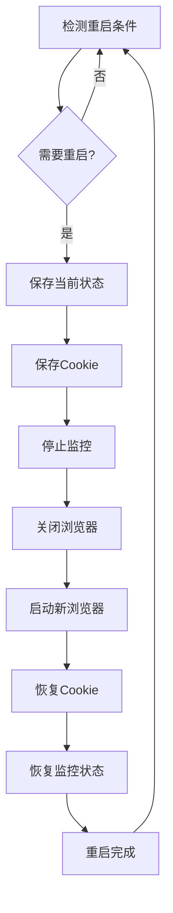

# Chromium重启管理器

## 概述

Chromium重启管理器是一个智能的浏览器进程管理系统，专门设计用于解决长时间运行的Playwright脚本中的内存泄漏问题。通过定期重启Chromium进程和智能内存监控，确保系统的稳定性和性能。

## 主要功能

### 🔄 自动重启机制
- **定时重启**: 按配置的时间间隔自动重启Chromium进程
- **内存阈值重启**: 当内存使用超过设定阈值时自动触发重启
- **智能重启**: 检测内存泄漏模式并主动重启

### 📊 状态持久化
- **监控状态保存**: 重启前保存所有监控会话状态
- **Cookie持久化**: 自动保存和恢复浏览器Cookie
- **配置备份**: 定期备份系统配置和状态

### 🎮 Web管理界面
- **实时监控**: 查看系统状态、内存使用、重启历史
- **配置管理**: 在线调整重启参数和监控设置
- **手动控制**: 支持手动触发重启、暂停/恢复自动重启

### 📈 性能优化
- **重启性能监控**: 跟踪重启时间和成功率
- **内存使用分析**: 监控内存使用趋势和泄漏检测
- **优化建议**: 基于性能数据提供优化建议

## 安装和配置

### 1. 依赖要求

```bash
pip install flask asyncio sqlite3 psutil
```

### 2. 配置文件

在 `config.json` 中添加重启管理器配置：

```json
{
  "browser": {
    "restart_manager": {
      "enabled": true,
      "interval_hours": 6,
      "memory_threshold_mb": 2048,
      "max_restart_attempts": 3,
      "restart_timeout_seconds": 300,
      "enable_memory_monitoring": true,
      "enable_performance_monitoring": true,
      "auto_restart_on_memory_leak": true,
      "preserve_monitoring_state": true,
      "preserve_cookies": true,
      "backup_interval_minutes": 30,
      "notification_enabled": false,
      "web_interface": {
        "enabled": true,
        "host": "127.0.0.1",
        "port": 8899
      }
    }
  }
}
```

### 3. 配置参数说明

| 参数 | 类型 | 默认值 | 说明 |
|------|------|--------|------|
| `enabled` | boolean | true | 是否启用重启管理器 |
| `interval_hours` | float | 6 | 自动重启间隔（小时） |
| `memory_threshold_mb` | int | 2048 | 内存阈值（MB） |
| `max_restart_attempts` | int | 3 | 最大重启尝试次数 |
| `restart_timeout_seconds` | int | 300 | 重启超时时间（秒） |
| `enable_memory_monitoring` | boolean | true | 启用内存监控 |
| `enable_performance_monitoring` | boolean | true | 启用性能监控 |
| `auto_restart_on_memory_leak` | boolean | true | 检测到内存泄漏时自动重启 |
| `preserve_monitoring_state` | boolean | true | 重启时保存监控状态 |
| `preserve_cookies` | boolean | true | 重启时保存Cookie |
| `backup_interval_minutes` | int | 30 | 备份间隔（分钟） |
| `notification_enabled` | boolean | false | 启用通知 |

#### Web界面配置

| 参数 | 类型 | 默认值 | 说明 |
|------|------|--------|------|
| `web_interface.enabled` | boolean | true | 启用Web管理界面 |
| `web_interface.host` | string | "127.0.0.1" | Web界面绑定地址 |
| `web_interface.port` | int | 8899 | Web界面端口 |

## 使用方法

### 1. 启动系统

重启管理器会随着 `BrowserManager` 自动启动：

```python
from browser_manager import BrowserManager
from url_manager import URLManager
from monitor_manager import MonitorManager

# 创建管理器实例
url_manager = URLManager()
monitor_manager = MonitorManager()
browser_manager = BrowserManager(url_manager, monitor_manager, config)

# 初始化（会自动启动重启管理器）
await browser_manager.initialize()
```

### 2. Web管理界面

启动后访问 Web 管理界面：

```
http://127.0.0.1:8899
```

界面功能：
- **状态概览**: 查看重启管理器状态、内存使用、下次重启时间
- **控制面板**: 手动触发重启、暂停/恢复自动重启
- **配置设置**: 在线调整重启参数
- **性能报告**: 查看重启性能统计和优化建议
- **重启历史**: 查看历史重启记录

### 3. 编程接口

#### 获取状态

```python
from restart_integration import get_restart_status

status = await get_restart_status()
print(f"重启管理器状态: {status}")
```

#### 手动触发重启

```python
from restart_integration import manual_restart

result = await manual_restart("用户手动触发")
if result['success']:
    print("重启成功")
else:
    print(f"重启失败: {result['error']}")
```

#### 获取配置

```python
from restart_integration import get_restart_config

config = get_restart_config()
print(f"当前配置: {config}")
```

## 工作原理

### 1. 重启流程



### 2. 状态持久化

- **监控会话**: 保存每个监控会话的URL、状态、配置
- **系统状态**: 保存浏览器配置、重启统计、性能数据
- **Cookie数据**: 保存所有页面的Cookie信息
- **备份机制**: 定期创建状态快照和数据库备份

### 3. 内存监控

- **实时监控**: 持续监控Chromium进程内存使用
- **泄漏检测**: 分析内存使用趋势，检测异常增长
- **阈值触发**: 内存使用超过阈值时自动触发重启
- **性能分析**: 记录内存使用模式和重启效果

## 故障排除

### 1. 常见问题

#### 重启管理器无法启动
- 检查配置文件格式是否正确
- 确认所有依赖包已安装
- 查看控制台错误信息

#### Web界面无法访问
- 检查端口是否被占用
- 确认防火墙设置
- 验证 `web_interface.enabled` 配置

#### 重启失败
- 检查 `restart_timeout_seconds` 设置
- 查看重启日志和错误信息
- 确认系统资源充足

### 2. 日志和调试

重启管理器会输出详细的日志信息：

```
重启管理器已启动
🔄 Chromium重启管理器
====================================
📊 状态: ✅ 已启用
⏰ 重启间隔: 6.0 小时
💾 内存阈值: 2048 MB
🔧 自动重启内存泄漏: ✅ 是
🌐 Web管理界面: http://127.0.0.1:8899
====================================
```

### 3. 性能优化建议

- **调整重启间隔**: 根据实际内存使用情况调整 `interval_hours`
- **优化内存阈值**: 根据系统配置设置合适的 `memory_threshold_mb`
- **启用性能监控**: 通过性能数据优化重启策略
- **定期清理**: 清理旧的备份文件和日志

## 高级功能

### 1. 自定义重启策略

可以通过修改 `ChromiumRestartManager` 类实现自定义重启策略：

```python
class CustomRestartManager(ChromiumRestartManager):
    async def should_restart(self):
        # 自定义重启条件
        return custom_condition_check()
```

### 2. 通知集成

支持集成外部通知系统：

```python
# 在配置中启用通知
"notification_enabled": true,
"notification_webhook_url": "https://your-webhook-url"
```

### 3. 性能监控扩展

可以扩展性能监控功能：

```python
from performance_optimizer import PerformanceOptimizer

optimizer = PerformanceOptimizer()
await optimizer.start_monitoring()
```

## 更新日志

### v1.0.0
- 初始版本发布
- 基本重启管理功能
- Web管理界面
- 状态持久化
- 性能监控

## 支持和反馈

如有问题或建议，请通过以下方式联系：

- 查看日志文件获取详细错误信息
- 检查配置文件设置
- 访问Web管理界面查看系统状态

## 许可证

本项目采用 MIT 许可证。